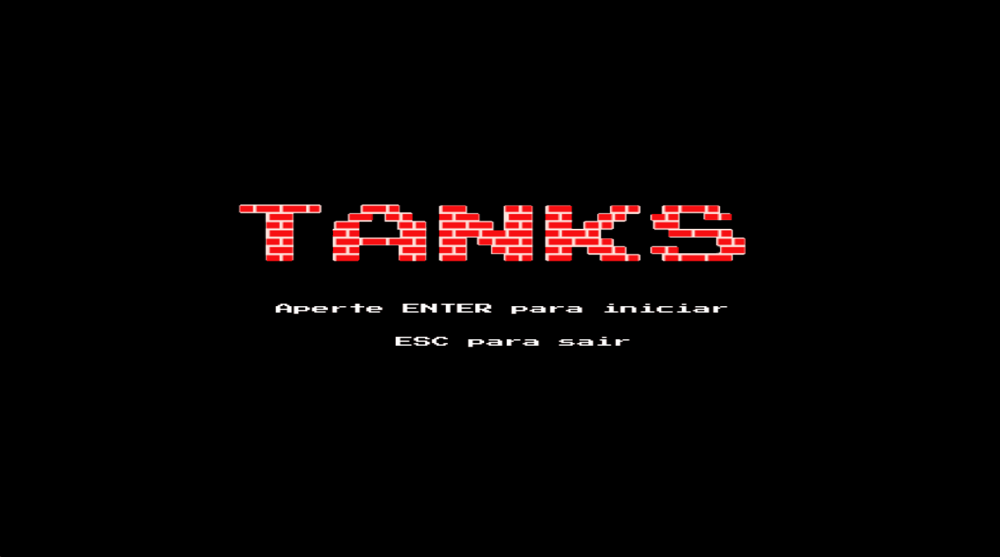

<h1 align="center"> Tank-1990-3D 🎮🕹 </h1>

## ℹ️ Sobre o projeto

Este trabalho apresenta a implementação do jogo Tank 1990, utilizando a linguagem C++ e as bibliotecas OpenGL e Glut. Desenvolvido para a disciplina de Computação Gráfica na Universidade Federal do Piauí, 2023.1.

## ✨Funcionalidades do projeto

1. Para a movimentação do tank deve utilizar as setas de **cima, baixo, direita e esquerda** (⬆️⬇️⬅️➡️);
2. Para atirar deve usar a tecla **Q/q**;
3. No menu iniciar pode começar o jogo apertando **ENTER** ou sair apertando **ESC**;
4. Na tela de Game Over ou Game Win pode sair do jogo apertando **ESC**.

  

## 🛠️ Tecnologias usadas

Neste projeto foram usadas as seguintes tecnologias:

> C++;

> Falcon;

> OpenGL;

> Glut.

## ▶️ Como executar

Para executar, basta abrir o arquivo `Projeto.exe`.

## 🗂️ Organização do projeto

1. **Pasta `Sounds`:** Nessa pasta estão os sons utilizados no jogo.
2. **Pasta `Texturas`:** Nessa pasta estão as texturas utilizadas nos objetos do jogo, bem como as imagens que geraram elas.
3. **Arquivo `audio.h`:** Nesse arquivo estão as variáveis de controle para os sons do jogo, e as funções `playAudio`, `playGameOverAudio`, `playGameWinAudio`, `playMenuAudio` utilizadas para reproduzir os áudios em cada momento do jogo.
4. **Arquivo `bloco.h`:** Nesse arquivo estão as funções que definem os blocos que são utilizados no jogo (blocoVida, parede, tijolo, metal, arbusto, águia, chão, água, gelo).
5. **Arquivo `bonus.h`:** Nesse arquivo está definida a função que cria um objeto de bônus e também as variáveis de controle para cada tipo de bônus.
6. **Arquivos `jogador.h` e `inimigo.h`:** Nesses arquivos estão definidos *struct* com as propriedades de jogador e inimigo.
7. **Arquivo `mapa.h`:** Nesse arquivo estão preparadas as texturas de cada objeto e onde são colocadas as funções para criação do mapa do jogo.
8. **Arquivo `projetil.h`:** Nesse arquivo é criado um *struct* com as propriedades de um projetil e também é criado o desenho do projetil.
9. **Arquivo `textos.h`:** Nesse arquivo são criadas as funções que desenham as vidas do jogador, do inimigo e também os bônus ativos.
10. **Arquivo `main.h`:** Arquivo principal do projeto, onde estão as funções mais importantes do OpenGL e as funções que são chamadas constantemente.